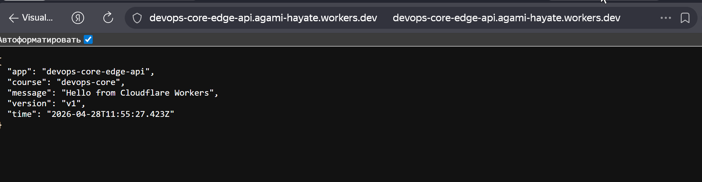
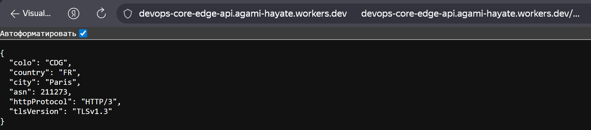
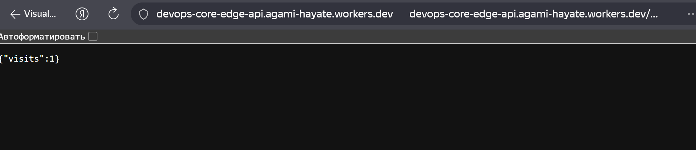

# Lab 17 — Cloudflare Workers Edge Deployment Report

## 1. Deployment Summary

*   **Worker URL:** `https://devops-core-edge-api.agami-hayate.workers.dev`
*   **Main Routes:**
    *   `/` — Application info and build version.
    *   `/health` — Health check (ok).
    *   `/info` — Short JSON with app name.
    *   `/edge` — Cloudflare edge metadata (colo, country, city, ASN, protocol, TLS).
    *   `/counter` — Persistent counter using Cloudflare Workers KV.
*   **Configuration Used (`wrangler.jsonc`):**
    *   `name`: devops-core-edge-api
    *   `compatibility_date`: 2026-04-28
    *   `compatibility_flags`: `nodejs_compat`
    *   `vars`: `APP_NAME`, `COURSE_NAME`, `BUILD_VERSION`
    *   `kv_namespaces`: Namespace binding `SETTINGS`.
    *   Secrets: `API_TOKEN`, `ADMIN_EMAIL`.

## 2. Evidence

*   **Screenshot 1: API Root Response (`/`)**
    

*   **Screenshot 2: `/edge` JSON response**
    

*   **Screenshot 3: `/counter` response**
    

## 3. Kubernetes vs Cloudflare Workers Comparison

| Aspect | Kubernetes | Cloudflare Workers |
|--------|------------|--------------------|
| Setup complexity | **High.** Requires cluster setup, YAML manifests, Helm charts, and Ingress configuration. | **Low.** Account + `wrangler` CLI + a single config file (or just code). |
| Deployment speed | **Slower.** Build and push container image, roll out pods and ReplicaSets. | **Very fast.** JS/WASM deploy in seconds globally. |
| Global distribution | **Complex.** Multi-cluster and GeoDNS setup needed. | **Built-in.** Runs on Cloudflare edge worldwide automatically. |
| Cost (small apps) | **Higher base cost.** Minimum VM/cluster costs even at zero traffic. | **Low or free.** Pay-per-request with a large free tier. |
| State/persistence model | **Traditional.** Databases, PVs, StatefulSets, NFS. | **Edge-focused.** KV (eventual consistency), Durable Objects, D1, R2. |
| Control/flexibility | **Maximum.** Any runtime, background daemons, full network control. | **Limited.** JS/TS + WASM on V8 isolates, no long-running daemons, strict limits. |
| Best use case | Large microservices, databases, long-running jobs. | Lightweight APIs, edge middleware, fast response near users. |

## 4. When to Use Each

### Scenarios favoring Kubernetes
*   Full infrastructure control is required (private VPCs, custom ports, complex firewall rules).
*   The app depends on runtimes that do not fit V8/WASM constraints.
*   Long-running background workers or heavy batch processing is required.
*   Stateful systems must be self-hosted (PostgreSQL clusters, Kafka, Redis).

### Scenarios favoring Workers
*   Small HTTP APIs that need low latency from global locations.
*   BFF gateways, request proxying, A/B testing, header manipulation at the edge.
*   Lightweight CRUD on top of D1 or external APIs.

### Recommendation
Start with Workers for lightweight HTTP endpoints, webhooks, or teams that want minimal infrastructure work. Move to Kubernetes if the system grows into heavy background processing, large monoliths, or needs tight control of network and runtime environments. A practical hybrid approach is edge routing in Workers and core services in Kubernetes.

## 5. Reflection

*   **What felt easier than Kubernetes?**
    No Dockerfile, no Deployment/Service YAML, no cluster management. A single `wrangler deploy` ships globally in seconds.
*   **What felt more constrained?**
    State must use platform services (KV, D1, Durable Objects). The runtime is limited to V8 isolates, so no long-lived background processes.
*   **What changed because Workers is not a Docker host?**
    Configuration is injected as bindings and secrets on `env` in the request handler, rather than files and OS-level environment variables in a container.
