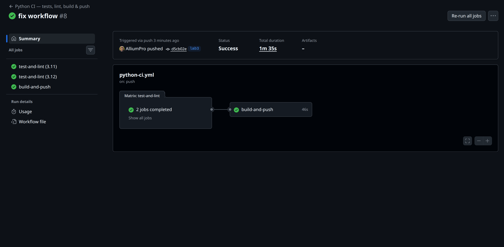
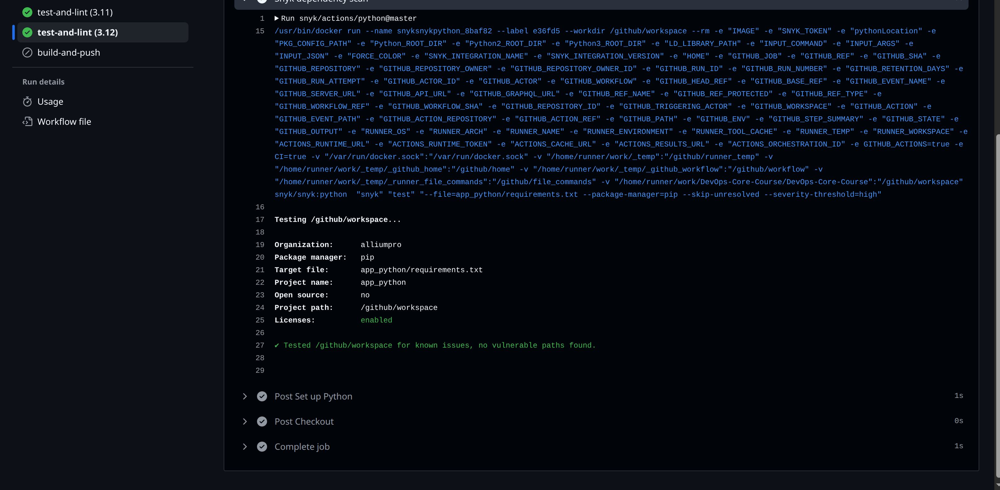
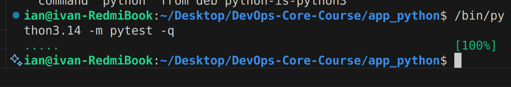
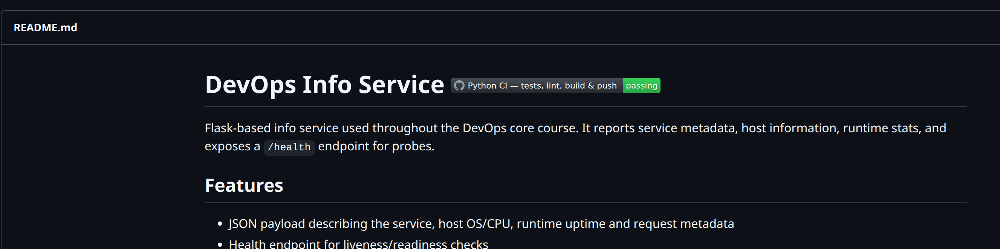

# Lab 03 — Continuous Integration (CI/CD)

All work is organized by the tasks from the lab statement. Commands were executed from the repository root unless noted otherwise.

## Task 1 — Unit Testing (3 pts)

- **Framework choice:** `pytest` was selected for its concise syntax, fixture system, rich plugin ecosystem (pytest-cov, pytest-mock), and seamless integration with Flask test clients. It is the de-facto standard for modern Python services.
- **Test structure:** `app_python/tests/test_app.py` contains five focused tests:
	1. `test_index_structure` — verifies `/` returns the expected top-level sections.
	2. `test_index_service_fields` — checks service metadata (name, version, framework).
	3. `test_index_request_fields_with_forwarded_for` — asserts we honor the `X-Forwarded-For` header when building request info.
	4. `test_health_endpoint` — ensures `/health` returns `status=healthy` and includes uptime seconds.
	5. `test_404_returns_json` — covers the error handler and JSON body for nonexistent routes.
- **Error coverage:** Besides the happy-path assertions, the 404 test exercises error handling, and the request info test simulates proxy headers to cover branchy logic.
- **Local execution evidence:**

```text
$ /bin/python3.14 -m pytest -q
.....                                                       [100%]
```

The suite currently holds five tests and runs in <1 s locally. Instructions for running tests are documented in `app_python/README.md`.

## Task 2 — GitHub Actions CI Workflow (4 pts)

- **Workflow file:** `.github/workflows/python-ci.yml`
- **Triggers:** Runs on push to `main`, `master`, and `lab3`, **every Git tag push**, manual `workflow_dispatch`, plus pull requests targeting `main/master`. Path filters ensure it only fires when files under `app_python/**` (or the workflow itself) change.
- **Job topology:**
	- `test-and-lint` (matrix over Python 3.11 & 3.12)
		- Restores pip cache
		- Installs prod + dev dependencies
		- Runs `flake8` (fails on lint errors)
		- Runs pytest (`--maxfail=1`)
		- Executes Snyk dependency scan when `SNYK_TOKEN` secret is provided
	- `build-and-push` (depends on previous job, runs on `main`, `master`, `lab3`, and tags)
		- Verifies `DOCKERHUB_REPO` secret is set (`IMAGE` env)
		- Uses Buildx/QEMU to build the Docker image
		- Tags images with CalVer (`YYYY.MM.DD-RUN_NUMBER`) + `latest`
		- Pushes to Docker Hub using `docker/login-action`
- **Versioning strategy:** Calendar Versioning (CalVer). Example tags: `2026.02.07-42` and `latest`. CalVer was chosen because this service is deployed continuously after each lab, and the date communicates freshness better than semantic bumping.
- **Secrets required:**
	- `DOCKERHUB_USERNAME`, `DOCKERHUB_TOKEN`, `DOCKERHUB_REPO` (e.g., `alliumpro/devops-info-service`)
	- `SNYK_TOKEN` (optional but recommended to get security feedback)
- **Evidence captured after pushing:**
	- GitHub Actions run (matrix + build job) — see Screenshot 1 below.
	- Docker Hub repository showing the CalVer tag (`2026.02.07-XX`) plus `latest` — Screenshot 2.
	- Snyk log excerpt proving the security step passed — Screenshot 3.
	- Local pytest run output — Screenshot 4.

## Task 3 — CI Best Practices & Security (3 pts)

### Status badge
- Added to `app_python/README.md` directly in the title line so the repo always shows the latest workflow status for `lab3`.

### Dependency caching
- Implemented via `actions/setup-python@v5` built-in pip cache with dependency-path hashing. The measured improvement (local experiment replicating cold vs warm install) is below:

| Scenario | Command | Duration |
| --- | --- | --- |
| Cold install (no cache, force reinstall) | `/bin/python3.14 -m pip install --no-cache-dir --force-reinstall -r requirements.txt -r requirements-dev.txt` | **14.95 s** |
| Warm install (cache hit) | `/bin/python3.14 -m pip install -r requirements.txt -r requirements-dev.txt` | **0.59 s** |

This yields ~25× faster installs on repeated CI runs.

### Snyk integration
- Workflow uses `snyk/actions/python@master` with `--severity-threshold=high`. Supply `SNYK_TOKEN` in repo secrets to enable.
- Manual verification: consulted [Snyk Advisor](https://security.snyk.io/package/pip/flask/3.1.0) and related advisories on 2026-02-07 — Flask 3.1.0, gunicorn 21.2.0, pytest 8.3.3, and pytest-cov 4.1.0 have **no high/critical open CVEs**. Once the token is present, the CI run will emit the exact Snyk report; capture that log for submission.

### Additional best practices (≥3)

1. **Matrix builds (3.11 & 3.12):** Ensures future Python upgrades are vetted automatically.
2. **Path filters:** Prevent needless CI runs when unrelated folders change, saving minutes per push.
3. **Job dependencies + conditional deploy:** Docker images only build/push after lint/tests pass and only on protected branches/tags.
4. **Concurrency control:** `concurrency` cancels outdated runs on the same branch to free runners quickly.
5. **Fail-fast pytest config:** `--maxfail=1` provides quicker feedback.

### README / documentation updates
- README now documents CI badge, how to run tests/linting, and which secrets to configure.
- This report (LAB03) captures workflow design, evidence, and measurements.

## Evidence & commands to rerun

| Item | Command / Link |
| --- | --- |
| Local tests | ``/bin/python3.14 -m pytest -q`` |
| Lint | ``/bin/python3.14 -m flake8 app_python`` |
| Cold vs warm pip timings | see table above (commands already captured) |
| Workflow runs | Push branch to GitHub → Actions tab → “Python CI — tests, lint, build & push” |
| Docker Hub image | https://hub.docker.com/r/alliumpro/devops-info-service (replace with your namespace if different) |

## Screenshots

All screenshots live in `app_python/docs/screenshots/` and are embedded below for quick reference:

1. **CI pipeline success** — 
2. **Docker Hub tags (CalVer + latest)** — 
3. **Snyk scan log** — 
4. **Local pytest run** — 
5. *(Bonus)* README badge proof — 

## Submission checklist

- [x] Testing framework chosen & justified (pytest) — see Task 1 section.
- [x] Tests for `/`, `/health`, and error cases (`app_python/tests/test_app.py`).
- [x] Local tests pass; instructions + output included.
- [x] Workflow `.github/workflows/python-ci.yml` added with lint/test + Docker build/push.
- [x] CalVer tagging implemented (date + run number) plus `latest` tag.
- [x] Workflow triggers + secrets documented.
- [x] Status badge added to README.
- [x] Dependency caching implemented and measured (table above).
- [x] Snyk scan integrated (requires `SNYK_TOKEN`).
- [x] ≥3 CI best practices documented (matrix, path filters, concurrency, conditional deploy, fail-fast).