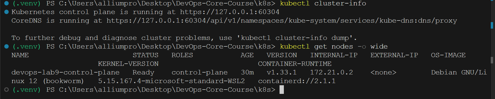
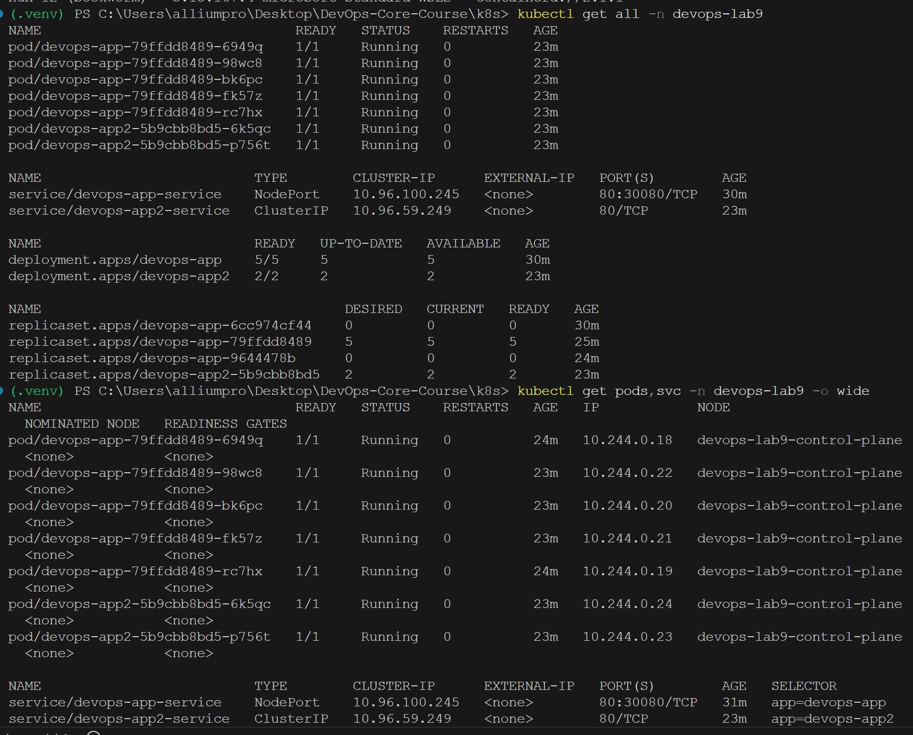
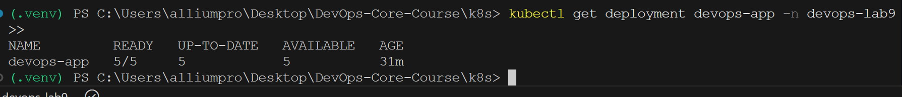
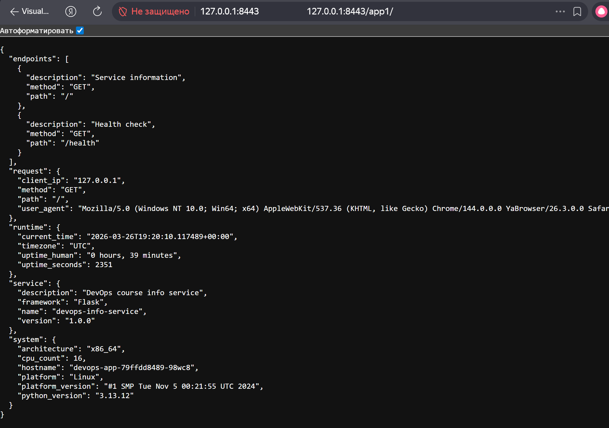
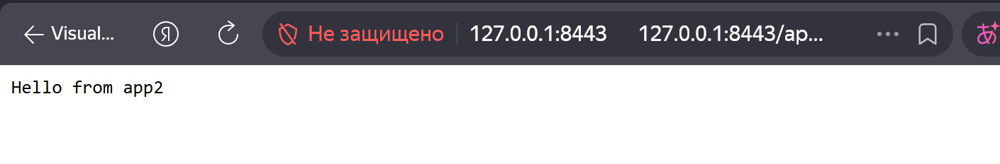

# LAB09 - Kubernetes Fundamentals

## 1. Architecture Overview

Deployment architecture for this lab:

- Namespace: `devops-lab9`
- Main app:
  - Deployment `devops-app`
  - 5 replicas after scaling step (started from 3)
  - Service `devops-app-service` (NodePort, `80 -> 5000`, nodePort `30080`)
- Bonus app:
  - Deployment `devops-app2` (2 replicas)
  - Service `devops-app2-service` (ClusterIP)
- Bonus ingress:
  - Ingress `devops-lab9-ingress`
  - Host `lab9.local`
  - `/app1` -> `devops-app-service`
  - `/app2` -> `devops-app2-service`
  - TLS termination using secret `lab9-tls`

Traffic flow:

1. Client -> Service (`NodePort`) for basic app access.
2. Client -> Ingress Controller (HTTPS) -> path-based routing to app1/app2 services.

Resource strategy:

- Main app requests/limits:
  - CPU request `100m`, limit `500m`
  - Memory request `128Mi`, limit `256Mi`
- App2 requests/limits:
  - CPU request `50m`, limit `200m`
  - Memory request `64Mi`, limit `128Mi`

## 2. Local Kubernetes Setup (Task 1)

Chosen local cluster: `kind`.

Why `kind`:

- Lightweight and Docker-based.
- Good fit for local laptop and CI-like workflows.
- Fast cluster recreation.

Installation and setup:

```powershell
winget install -e --id Kubernetes.kind --accept-package-agreements --accept-source-agreements
& "C:\Users\alliumpro\AppData\Local\Microsoft\WinGet\Packages\Kubernetes.kind_Microsoft.Winget.Source_8wekyb3d8bbwe\kind.exe" create cluster --name devops-lab9 --image kindest/node:v1.33.1 --wait 240s
kubectl config use-context kind-devops-lab9
```

Evidence:

```text
Kubernetes control plane is running at https://127.0.0.1:60304
CoreDNS is running at https://127.0.0.1:60304/api/v1/namespaces/kube-system/services/kube-dns:dns/proxy

NAME                        STATUS   ROLES           AGE   VERSION
devops-lab9-control-plane   Ready    control-plane   28s   v1.33.1
```

## 3. Manifest Files (Task 2, Task 3, Bonus)

1. `namespace.yml`
- Creates dedicated namespace `devops-lab9`.

2. `deployment.yml`
- Main app deployment.
- Initial replicas: `3`.
- Rolling strategy:
  - `maxSurge: 1`
  - `maxUnavailable: 0`
- Health checks:
  - `livenessProbe` on `/health`
  - `readinessProbe` on `/health`
- Resource requests/limits configured.
- Labeling used for selectors and organization.

3. `service.yml`
- `NodePort` service for main app.
- Selector `app: devops-app`.
- Exposes `port 80` to container named port `http` (`5000`).
- Uses fixed nodePort `30080`.

4. `app2-deployment.yml` (bonus)
- Second app deployment (`hashicorp/http-echo:1.0.0`), 2 replicas.

5. `app2-service.yml` (bonus)
- ClusterIP service for second app.

6. `ingress.yml` (bonus)
- Ingress class `nginx`.
- Path routing:
  - `/app1(/|$)(.*)` -> `devops-app-service`
  - `/app2(/|$)(.*)` -> `devops-app2-service`
- TLS for host `lab9.local` with secret `lab9-tls`.

7. `tls-secret.example.yml` (bonus)
- Template for manually managed TLS secret.

## 4. Deployment Evidence (Task 2 + Task 3)

Apply core manifests:

```bash
kubectl apply -f k8s/namespace.yml
kubectl apply -f k8s/deployment.yml
kubectl apply -f k8s/service.yml
```

Runtime evidence:

```text
namespace/devops-lab9 created
deployment.apps/devops-app created
service/devops-app-service created
```

Image pull issue observed for remote tag `alliumpro/devops-app:lab08` (`ImagePullBackOff`).
For local kind execution, app image was built and loaded into cluster:

```bash
docker build -t devops-app:lab09-local app_python
kind load docker-image devops-app:lab09-local --name devops-lab9
kubectl set image deployment/devops-app app=devops-app:lab09-local -n devops-lab9
```

After fix:

```text
deployment "devops-app" successfully rolled out
```

Service state:

```text
service/devops-app-service   NodePort   10.96.100.245   80:30080/TCP
```

Endpoint verification (via port-forward):

```text
URL: http://127.0.0.1:8080/
{"service":{"name":"devops-info-service" ... }}

URL: http://127.0.0.1:8080/health
{"status":"healthy", ...}

URL: http://127.0.0.1:8080/metrics
python_info{implementation="CPython",major="3",minor="13",patchlevel="12",version="3.13.12"} 1.0
http_requests_total{endpoint="/health",method="GET",status_code="200"} 15.0
```

## 5. Operations Performed (Task 4)

### 5.1 Scaling to 5 replicas

Commands:

```bash
kubectl scale deployment/devops-app --replicas=5 -n devops-lab9
kubectl rollout status deployment/devops-app -n devops-lab9
kubectl get deployment devops-app -n devops-lab9
```

Evidence:

```text
deployment.apps/devops-app scaled
deployment "devops-app" successfully rolled out
NAME         READY   UP-TO-DATE   AVAILABLE   AGE
devops-app   5/5     5            5           ...
```

### 5.2 Rolling update

Update was demonstrated by changing configuration (`APP_ENV`), which triggers a new ReplicaSet:

```bash
kubectl set env deployment/devops-app APP_ENV=kubernetes-v2 -n devops-lab9
kubectl rollout status deployment/devops-app -n devops-lab9
kubectl rollout history deployment/devops-app -n devops-lab9
```

Evidence:

```text
deployment.apps/devops-app env updated
deployment "devops-app" successfully rolled out
REVISION  CHANGE-CAUSE
1         <none>
2         <none>
3         <none>
```

### 5.3 Rollback

Commands:

```bash
kubectl rollout undo deployment/devops-app -n devops-lab9
kubectl rollout status deployment/devops-app -n devops-lab9
kubectl rollout history deployment/devops-app -n devops-lab9
```

Evidence:

```text
deployment.apps/devops-app rolled back
deployment "devops-app" successfully rolled out
REVISION  CHANGE-CAUSE
1         <none>
3         <none>
4         <none>
```

## 6. Additional Evidence (Task 5 Requirement)

`kubectl get all -n devops-lab9` (excerpt):

```text
NAME                              READY   STATUS    RESTARTS
pod/devops-app-79ffdd8489-6949q   1/1     Running   0
pod/devops-app-79ffdd8489-98wc8   1/1     Running   0
pod/devops-app-79ffdd8489-bk6pc   1/1     Running   0
pod/devops-app-79ffdd8489-fk57z   1/1     Running   0
pod/devops-app-79ffdd8489-rc7hx   1/1     Running   0

service/devops-app-service        NodePort   10.96.100.245   80:30080/TCP

deployment.apps/devops-app        5/5
```

`kubectl describe deployment devops-app -n devops-lab9` (key fields):

```text
Replicas:               5 desired | 5 updated | 5 total | 5 available
StrategyType:           RollingUpdate
RollingUpdateStrategy:  0 max unavailable, 1 max surge
Image:                  devops-app:lab09-local
Liveness:               http-get /health
Readiness:              http-get /health
Requests:               cpu=100m, memory=128Mi
Limits:                 cpu=500m, memory=256Mi
```

## Screenshots and Visual Proof

1. Cluster setup (`kubectl cluster-info`, `kubectl get nodes`)



This screenshot confirms that the control plane is up and the kind node is in `Ready` state.

2. Resource overview (`kubectl get all -n devops-lab9`)



Here we can see the running pods, service, deployment, and replica sets in the lab namespace.

3. Deployment state (`kubectl get deployment devops-app -n devops-lab9`)



This verifies the target replica count and that all replicas are available.

4. Application route `/app1`



Ingress route `/app1` returns the Flask application response.

5. Application route `/app2`



Ingress route `/app2` returns the second service response (`Hello from app2`).

## 7. Production Considerations

Health checks:

- Both liveness and readiness probes target `/health`.
- Liveness restarts unhealthy containers.
- Readiness avoids sending traffic to pods not ready yet.

Resource policy rationale:

- Requests guarantee schedulable baseline resources.
- Limits prevent single pod from exhausting node resources.
- Current values are conservative and suitable for local lab load.

Recommended production improvements:

1. Replace static NodePort with Ingress + LoadBalancer in real environment.
2. Add HPA (CPU/custom metrics-based autoscaling).
3. Use pinned immutable images (`sha256`) and signed artifacts.
4. Add PodDisruptionBudget and topology spread constraints.
5. Add centralized logging and alerting (Prometheus, Alertmanager, Loki, Grafana).
6. Move secret generation to cert-manager + trusted issuer.

Monitoring and observability:

- App already exposes Prometheus metrics (`/metrics`).
- Can be scraped by Prometheus and visualized in Grafana.

## 8. Challenges and Solutions

1. No active local cluster initially
- Problem: `kubectl cluster-info` failed (`localhost:8080 refused`).
- Solution: installed `kind` and created cluster with Kubernetes `v1.33.1`.

2. Docker daemon not available at first kind start
- Problem: kind failed to access Docker pipe.
- Solution: started Docker Desktop and retried cluster creation.

3. ImagePullBackOff for remote app image
- Problem: tag from manifest could not be pulled in cluster.
- Solution: built local image and loaded it into kind (`kind load docker-image`), then updated deployment image.

4. OpenSSL config path on Windows
- Problem: cert generation failed due missing default `openssl.cnf` path.
- Solution: set `OPENSSL_CONF` explicitly to Git OpenSSL config path and regenerated certificate.

What was learned:

- Declarative manifests are stable, but runtime validation always uncovers environment-specific issues.
- Rollout/rollback tooling in Kubernetes is straightforward and reliable when probes/resources are configured correctly.
- Ingress + TLS adds significant operational value versus direct NodePort usage.

## 9. Bonus - Ingress with TLS

Second app deployment:

```bash
kubectl apply -f k8s/app2-deployment.yml
kubectl apply -f k8s/app2-service.yml
kubectl rollout status deployment/devops-app2 -n devops-lab9
```

Ingress controller installation (kind profile):

```bash
kubectl apply -f https://raw.githubusercontent.com/kubernetes/ingress-nginx/main/deploy/static/provider/kind/deploy.yaml
kubectl wait --namespace ingress-nginx --for=condition=ready pod --selector=app.kubernetes.io/component=controller --timeout=300s
```

TLS setup:

```bash
$env:OPENSSL_CONF = "C:\Program Files\Git\usr\ssl\openssl.cnf"
openssl req -x509 -nodes -days 365 -newkey rsa:2048 -keyout k8s/tls.key -out k8s/tls.crt -subj "/CN=lab9.local/O=lab9.local"
kubectl create secret tls lab9-tls --cert=k8s/tls.crt --key=k8s/tls.key -n devops-lab9
kubectl apply -f k8s/ingress.yml
```

Ingress evidence:

```text
NAME                  CLASS   HOSTS        ADDRESS     PORTS
devops-lab9-ingress   nginx   lab9.local   localhost   80, 443

TLS:
  lab9-tls terminates lab9.local
Rules:
  /app1 -> devops-app-service:80
  /app2 -> devops-app2-service:80
```

HTTPS routing verification (through ingress-controller port-forward):

```text
https://127.0.0.1:8443/app1/ -> 200; body={"endpoints":[...]
https://127.0.0.1:8443/app2/ -> 200; body=Hello from app2
```

Why Ingress over multiple NodePorts:

- Single entry point for many services.
- Path/host-based L7 routing.
- Native TLS termination at edge.
- Better fit for production traffic management.

## 10. Cleanup

```bash
kubectl delete ns devops-lab9
kubectl delete ns ingress-nginx
kind delete cluster --name devops-lab9
```

## Result

Lab 09 is completed and reproducible from this repository.

What was done in practice:

- local kind cluster was configured and validated;
- application was deployed via declarative manifests with probes/resources;
- service access and endpoints were checked;
- scaling, rolling update, and rollback were demonstrated;
- bonus Ingress + TLS routing for two apps was configured and tested.

The report now includes both terminal evidence and visual screenshots, so it is ready for submission.
