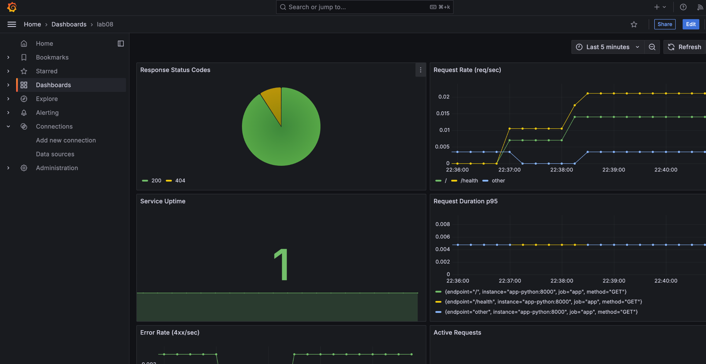
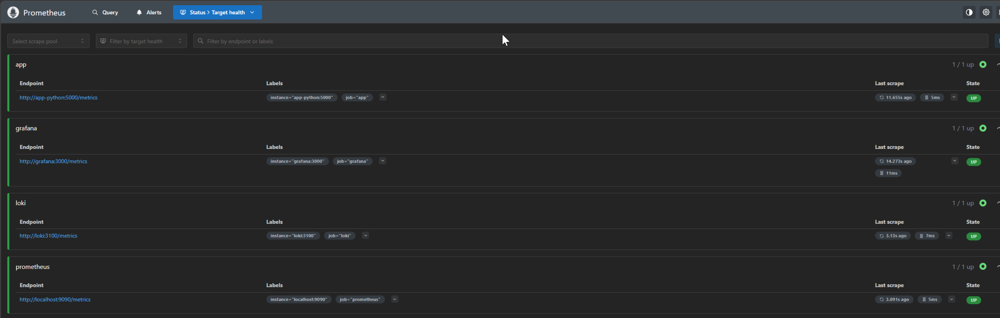
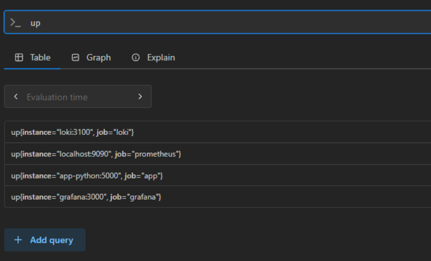

# Lab 08 — Metrics & Monitoring with Prometheus Report

[](https://github.com/AlliumPro/DevOps-Core-Course/actions/workflows/ansible-deploy.yml?query=branch%3Alab06)

> This lab was implemented and validated on the course VM: the Flask app now exposes Prometheus metrics, Prometheus scrapes app and platform targets, and Grafana visualizes RED-style metrics in a custom dashboard.

---

## 1. Architecture

```text
Client traffic -> app-python (Flask)
                    |
                    v
       /metrics endpoint (Prometheus format)
                    |
                    v
      Prometheus scrape jobs every 15s
                    |
                    v
      Prometheus TSDB (retention: 15d / 10GB)
                    |
                    v
       Grafana (Prometheus datasource)
                    |
                    v
   Metrics dashboard (RED + health panels)

In parallel (from Lab 07):
app-python logs -> Promtail -> Loki -> Grafana logs dashboard
```

Runtime topology:
- `app-python` on `:8000` (container `:5000`)
- `prometheus` on `:9090`
- `loki` on `:3100`
- `promtail` on `:9080`
- `grafana` on `:3000`

---

## 2. Application Instrumentation

### 2.1 Installed dependency

File:
- `app_python/requirements.txt`

Added:
```txt
prometheus-client==0.23.1
```

### 2.2 Implemented metrics in Flask app

File:
- `app_python/app.py`

Implemented metric families:

1. HTTP request counter (Rate / Errors foundation)
```python
http_requests_total{method, endpoint, status_code}
```

2. HTTP request duration histogram (Duration foundation)
```python
http_request_duration_seconds{method, endpoint}
```

3. In-progress requests gauge (concurrency / load)
```python
http_requests_in_progress{method, endpoint}
```

4. App-specific business counter
```python
devops_info_endpoint_calls_total{endpoint}
```

5. App-specific collection latency histogram
```python
devops_info_system_collection_seconds
```

### 2.3 Request lifecycle instrumentation

Implemented via Flask hooks:
- `before_request`:
  - captures start time
  - normalizes endpoint labels to low-cardinality values
  - increments `http_requests_in_progress`
- `after_request`:
  - increments `http_requests_total`
  - observes `http_request_duration_seconds`
  - decrements `http_requests_in_progress`

Cardinality control:
- Endpoint labels are normalized (`/`, `/health`, `/metrics`, `/unknown`) to avoid unbounded label explosion.

### 2.4 Metrics endpoint

Implemented endpoint:
- `GET /metrics`
- returns Prometheus exposition format (`text/plain`)

---

## 3. Prometheus Configuration

### 3.1 Docker Compose service

File:
- `monitoring/docker-compose.yml`

Added service:
- image: `prom/prometheus:v3.9.0`
- port: `9090:9090`
- config mount: `./prometheus/prometheus.yml:/etc/prometheus/prometheus.yml:ro`
- persistent volume: `prometheus-data:/prometheus`
- retention flags:
  - `--storage.tsdb.retention.time=15d`
  - `--storage.tsdb.retention.size=10GB`
- health check:
  - `GET /-/healthy`

### 3.2 Scrape config

File:
- `monitoring/prometheus/prometheus.yml`

Global settings:
- `scrape_interval: 15s`
- `evaluation_interval: 15s`

Configured jobs:
1. `prometheus` -> `localhost:9090`
2. `app` -> `app-python:5000` (`/metrics`)
3. `loki` -> `loki:3100` (`/metrics`)
4. `grafana` -> `grafana:3000` (`/metrics`)

---

## 4. Grafana Dashboards

### 4.1 Data sources

Files:
- `monitoring/grafana/provisioning/datasources/datasources.yml`

Provisioned data sources:
- Loki (`uid: loki`)
- Prometheus (`uid: prometheus`)

### 4.2 Dashboard provisioning

Files:
- `monitoring/grafana/provisioning/dashboards/dashboards.yml`
- `monitoring/grafana/dashboards/lab08-metrics.json`

Lab 8 dashboard panels (7 total):
1. Request Rate by Endpoint
2. Error Rate (5xx)
3. Request Duration p95
4. Request Duration Heatmap
5. Active Requests
6. Status Code Distribution
7. Application Uptime

---

## 5. PromQL Examples

### 5.1 Request rate per endpoint (RED: Rate)
```promql
sum by (endpoint) (rate(http_requests_total[5m]))
```
Shows throughput by endpoint.

### 5.2 Error rate (RED: Errors)
```promql
sum(rate(http_requests_total{status_code=~"5.."}[5m]))
```
Shows server-side failures per second.

### 5.3 p95 latency (RED: Duration)
```promql
histogram_quantile(0.95, sum by (le, endpoint) (rate(http_request_duration_seconds_bucket[5m])))
```
Shows 95th percentile response latency.

### 5.4 Latency distribution heatmap
```promql
sum by (le) (rate(http_request_duration_seconds_bucket[5m]))
```
Visualizes request duration distribution across buckets.

### 5.5 Concurrent requests
```promql
sum(http_requests_in_progress)
```
Shows current in-flight request count.

### 5.6 Status code distribution
```promql
sum by (status_code) (rate(http_requests_total[5m]))
```
Shows response class composition over time.

### 5.7 Service uptime
```promql
up{job="app"}
```
Returns `1` when target is healthy and scrapeable.

---

## 6. Production Setup

Implemented hardening in `monitoring/docker-compose.yml`:

1. Health checks:
- Prometheus: `/-/healthy`
- Loki: `/ready`
- Grafana: `/api/health`
- App: `/health`

2. Resource limits:
- Prometheus: `1G`, `1.0 CPU`
- Loki: `1G`, `1.0 CPU`
- Grafana: `512M`, `0.5 CPU`
- App: `256M`, `0.5 CPU`

3. Persistence:
- `prometheus-data`
- `loki-data`
- `grafana-data`

4. Retention:
- Prometheus: `15d` and max `10GB`
- Loki: `168h` (7 days) retained from Lab 7

5. Security:
- Grafana anonymous access disabled
- Admin credentials provided via environment variables

---

## 7. Testing Results

### 7.1 Automated application tests

Command:
```bash
cd app_python
../.venv/Scripts/python.exe -m pytest -q
```

Result:
- `6 passed` (including new metrics endpoint test)

### 7.2 Manual verification commands

Stack up:
```bash
cd monitoring
~/.local/bin/docker-compose up -d
~/.local/bin/docker-compose ps
```

Prometheus targets:
```bash
curl -s http://127.0.0.1:9090/api/v1/targets
```
Expected: all configured targets in `up` state.

App metrics endpoint:
```bash
curl -s http://127.0.0.1:8000/metrics
```
Expected metric families:
- `http_requests_total`
- `http_request_duration_seconds`
- `http_requests_in_progress`
- `devops_info_endpoint_calls_total`
- `devops_info_system_collection_seconds`

Observed from the attached screenshots:
- Prometheus target health shows all 4 configured jobs in `UP` state (`app`, `grafana`, `loki`, `prometheus`).
- Query `up` returns four active series, one per monitored job.
- Grafana `Lab08 - Application Metrics` dashboard is populated with live request/latency data.
- Error panel currently shows no data, which is expected because no 5xx traffic was generated during this capture window.

### 7.3 Attached screenshots

1. Grafana dashboard `Lab08 - Application Metrics`:



2. Prometheus Targets page with all jobs in `UP` state:



3. Prometheus query result for `up`:



---

## 8. Metrics vs Logs (Lab 8 vs Lab 7)

When to use metrics:
- Capacity/trend analysis (rate, latency percentiles, error ratio)
- Alerting thresholds and SLO/SLA tracking
- Low-cost long-term aggregated monitoring

When to use logs:
- Event-level debugging and root-cause analysis
- Detailed request context and stack traces
- Forensics on specific failures

Practical model in this project:
- Metrics (Prometheus) answer: “How much/how often/how fast?”
- Logs (Loki) answer: “What exactly happened and why?”

---

## 9. Bonus — Ansible Automation

Extended role:
- `ansible/roles/monitoring`

Implemented bonus requirements:

1. Parameterized Prometheus variables in:
- `ansible/roles/monitoring/defaults/main.yml`

2. Templated Prometheus configuration:
- `ansible/roles/monitoring/templates/prometheus.yml.j2`

3. Full stack compose template now includes:
- Loki + Promtail + Prometheus + Grafana + app
- `ansible/roles/monitoring/templates/docker-compose.yml.j2`

4. Grafana provisioning for both data sources:
- Loki + Prometheus via `grafana-datasource.yml.j2`

5. Dashboard auto-provisioning for both labs:
- `grafana-lab07-dashboard.json.j2`
- `grafana-lab08-dashboard.json.j2`

6. Deployment checks include readiness waits for:
- Loki
- Prometheus
- Grafana

Playbook:
- `ansible/playbooks/deploy-monitoring.yml`

Single-command deployment:
```bash
ansible-playbook ansible/playbooks/deploy-monitoring.yml -i ansible/inventory/hosts.ini
```

---

## 10. Challenges & Solutions

1. Challenge: avoid high-cardinality labels in HTTP metrics.
- Solution: normalized endpoint labels and grouped unknown paths as `/unknown`.

2. Challenge: keep logs and metrics stack cohesive in one Grafana instance.
- Solution: provisioned dual data sources and folder-based dashboard provisioning.

3. Challenge: enforce production retention and resources without external orchestration.
- Solution: added explicit retention flags, health checks, and service limits in Compose + Ansible templates.

---

## 11. Summary

Lab 08 deliverables are completed and validated:
- Flask app instrumented with Prometheus metrics and `/metrics` endpoint
- Prometheus added and scraping app + platform targets
- Grafana integrated with Prometheus and custom metrics dashboard
- Production hardening applied (health checks, limits, retention, persistence)
- Bonus Ansible automation completed for full observability stack
- Report prepared with architecture, PromQL examples, and screenshot evidence
